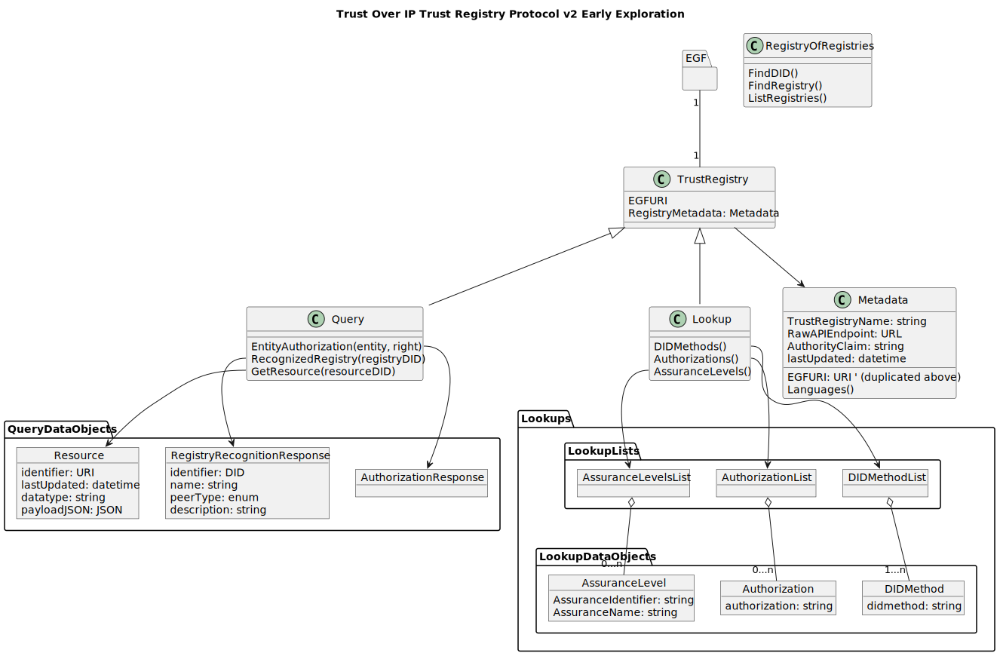

# Placeholder TRTF README v2

The Trust Registry Protocol serves to provide a simple interface to the plethora of systems that contain answers that are required 
    to make trust decisions. 

    The TRP does not:  
      * implement governance - the system-of-record that supports the TRP may do this.
      * make decisions - the TRP serves up data that are inputs to trust decisions.
      * assign Roles or Rights, though a consuming system may take information that is received via the TRP and assign these.

## UPDATE 2023-09-07

Key changes made:
  * shifting to OAS/Swagger (.yaml format) for main developer-level documentation.
  * Diagrams will be used but OAS file is the source-of-truth.

## Requirements

Requirements capture is located at:

* [requirements.md](../v2/requirements.md) - contains a rudimentary set of requirements (WORK IN PROGRESS - really just started)
* 

## OpenAPI Specification

The first "concrete" API specification is an Open API Specification v3 YAML file. 

[OAS (.yaml) for TRP v2](../v2/api/WIP.toip.trustregistry.api.yaml)

## Logical Model

### High-Level

We provide a high-level object model (NOTE: source of truth is the Swagger as this diagram may be out of date during development)

### Integration Model

As the TRP is a protocol, those systems that don't natively support it can be connected via "bridge". 

An early example is shown below:

